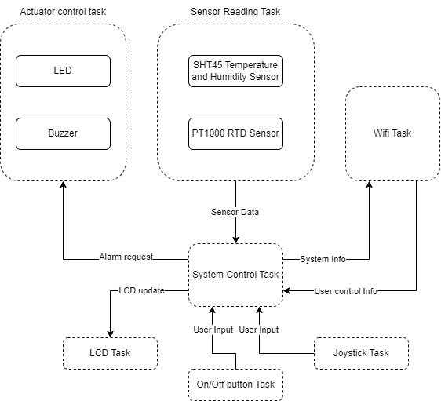

# a07g-exploring-the-CLI

* Team Number: Team 10 
* Team Name: Web Weaver
* Team Members: Zhiye Zhang, Yunlong Han
* GitHub Repository URL:
* Description of test hardware: (development boards, sensors, actuators, laptop + OS, etc)

# 1.Software architecture

## 1. HRS & SRS

### HRS:
**HRS 01** - The project shall be based on SAMW25.

**HRS 02** - The project shall have 1 SHT45 sensor, 1 RTD temperature probe, 1 LCD screen, 1 Wi-Fi Module, 1 LED, 1 Buzzer, 1 Joystick and several button and indication LED.

**HRS 03** - The project should be able to switch between different sensors.

**HRS 04** - The project shall use a joystick as user input.

**HRS 05** - The project shall have a SD card for storage purpose.

**HRS 06** - The project shall display a main user menu on LCD screen.

**HRS 07** -  The project shall use a buzzer to sound alarms or alerts.

**HRS 08** - The project shall have a on/off button to launch the system.

**HRS 09** - The project shall have some LED indications to indication the system status.

**HRS 10** - The project shall use LiPo battery as power source together with boost circuit for 5V supply and buck circuit for 3.3V supply.

**HRS 11** - The project shall have a RTD temperature probe that can detect temperature from -50℃ to 280 ℃.

**HRS 12** - The project shall have a temperature and humidity sensor that can sense relative humidity from 0%RH to 100%RH, and temperature from -40℃ to 150℃. 

### SRS:
**SRS 01** - The main menu shall hold the classification of different recipes: BEEF/LAMB, PROK, CHICKEN, VEG, SEAFOOD and OTH

**SRS 02** - There shall be a home button on every screen to return to the main menu at any time.

**SRS 03** - There shall be a two level menu, the main menu hold the classification of different recipes, the submenu hold the specific recipe.

**SRS 04** - The first page of recipe shall show the INGR, Prep Time and Cook Time. 

**SRS 05** - The first page shall also have a START buttom to start cooking instruction.

**SRS 06** - The cooking instruction page shall have what to do in the current step, a graphical temperature display, a C/T with a START button, a NEXT button and PREV button

**SRS 07** - The graphical temperature display shall should a grap of a thermometer, following with the temperature value, and change color base on the range of temperature, and gives out warning when the temperature is too high. 

**SRS 08** - The C/T with a START button shall be able to countdown the cooking time, gives out alarm when the time is over.

**SRS 09**- The PREV and NEXT button shall be able to switch between different steps of a recipe.

**SRS 10** - The should be a value display of the kitchen temperature and humidity at every screen.

## 2. Block Diagram

## 3. Flow charts

### 1. Joystick Task flow chart

### 2. Sensor reading Task flow chart

# 2. Starter code

## 1	What does “InitializeSerialConsole()” do? In said function, what is “cbufRx” and “cbufTx”? What type of data structure is it? 

	* “InitializeSerialConsole()" initializes UART and registers callback. 
	* “cbufRx” and “cbufTx” are two functions which Initialize circular buffers for RX and TX.
	* Type of data structure is handle type

## 2	How are “cbufRx” and “cbufTx” initcircular_buf_initialized? Where is the library that defines them (please list the *C file they come from). 

	* They are initialized in "circular_buf_init" function. This function takes in their buffer name and size. Then reset the corresponding buffer
	* circular_buffer.c

## 3	Where are the character arrays where the RX and TX characters are being stored at the end? Please mention their name and size.

	* They are stored in cBufRx and cBufTx. Both size are 512

## 4	Where are the interrupts for UART character received and UART character sent defined? 

	* They are defined in functions "SerialConsoleWriteString(char *string)" and "SerialConsoleReadCharacter(uint8_t *rxChar)"

## 5	What are the callback functions that are called when: 
	a	A character is received? (RX)    usart_read_callback
	b	A character has been sent? (TX)  usart_write_callback

## 6	Explain what is being done on each of these two callbacks and how they relate to the cbufRx and cbufTx buffers. 

	* read: it is called when the system finishes receives all the bytes requested from a UART read job. This means that it should write to cbufRx buffers
	* write:it is called when the system finishes sending all the bytes requested from a UART read job. This means that it should write to cbufTx buffers

## 7	Draw a diagram that explains the program flow for UART receive – starting with the user typing a character and ending with how that characters ends up in the circular buffer “cbufRx”. Please make reference to specific functions in the starter code. 

## 8	Draw a diagram that explains the program flow for the UART transmission – starting from a string added by the program to the circular buffer “cbufTx” and ending on characters being shown on the screen of a PC (On Teraterm, for example). Please make reference to specific functions in the starter code. 

## 9	What is done on the function “startStasks()” in main.c? How many threads are started?

# 3. Debug logger module

As seen in serialConsole.c.

# 4.Wiretap the convo

## 1	Submit your answers to your GitHub repository README.md
## 2	Submit a photo of your hardware connections between the SAMW25 Xplained dev board and the logic analyzer. 
## 3	Submit a screenshot of the decoded message.
## 4	Submit a small capture file (i.e., the .sal file) of a wiretapped conversation (you don’t need to log 30 minutes worth of UART messages 🙂)

​	
